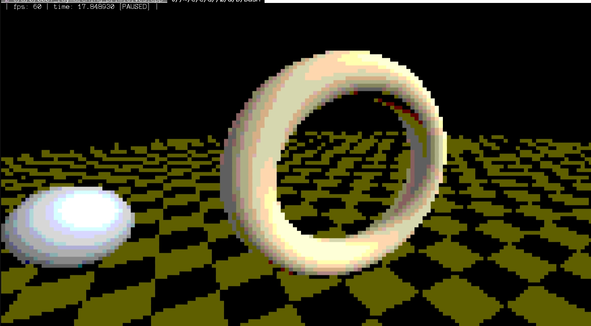

# Draft Point



This project is a didactic exploration of C++. The goal is to move away from low-level "machine instructions" and instead write code that serves as a clear statement of intent.

## Getting Started

### Prerequisites
- **C++ Compiler:** Clang (`clang++`) or GCC (`g++`) with C++26 support
- **Python Runtime:** Python 3.14+ and [`uv`](https://github.com/astral-sh/uv) package manager (for developer tooling)

### Cloning the Repository

This project depends on `project-mcp-tools` as a sibling repository. Clone it alongside:
```bash
git clone https://github.com/maxwellaguiarsilva/project-mcp-tools.git
git clone https://github.com/maxwellaguiarsilva/draft-point.git
cd draft-point
```

### Environment Setup (`PATH`) + Building and Running
To run developer tools and compiled binaries directly from the project root directory, add `./scripts` and `./dist` to your `PATH`:

```bash
export PATH=".:./scripts:./dist:$PATH"
cpp-compile
```

Built binaries are placed in the `dist/` directory.

## The `sak` Library (Swiss Army Knife)

The core of this project is the `sak` library. It is designed as a collection of generic, domain-independent utilities covering mathematics, geometry, and design patterns. 
- **Domain Agnostic:** It contains no business logic or hardware dependencies.
- **Modern Paradigms:** It leverages C++ features such as `ranges`, `views`, and custom `Niebloids` to reduce visual noise and promote **functional composition**.

## Project Highlights

### Developer Tooling (`project-mcp-tools`)
This project **depends** on [project-mcp-tools](https://github.com/maxwellaguiarsilva/project-mcp-tools), a Python framework that exposes developer tools through MCP, REST API, and CLI. It must be cloned as a sibling directory (see setup instructions above).

The bundled tools cover C++ development (compilation, static analysis, formatting verification, class/test scaffolding, include tree analysis), Python formatting, and git automation. See `project-mcp-tools/README.md` for the full tool catalog and architecture.

### Generic Multidimensional Point
The `sak::point` class is a high-level abstraction for N-dimensional arithmetic.
- **Range Integration:** It seamlessly converts from and to ranges (using `to_point`), allowing for expressive data pipelines.
- **Lazy Evaluation:** Supports pipe operators (`|`) for transformations, enabling complex geometric operations without immediate execution overhead.
- **Semantic Operators:** Arithmetic operations work intuitively across dimensions, treating the point as a first-class mathematical entity.

### Generic Pattern Dispatcher
A thread-safe, non-intrusive `dispatcher` implementation.
- **Weak Linkage:** Uses `std::weak_ptr` to store listeners, preventing circular dependencies and memory leaks.
- **Automatic Cleanup:** Identifies and removes expired listeners during event dispatching.
- **Robustness:** Handles exceptions during method invocation, returning a `std::expected` with detailed failure reports.

### Half-Block Pseudo-Pixels
The `tui::renderer` employs a "half-block" rendering technique to overcome terminal resolution limits.
- **Resolution Doubling:** By using the Unicode character `▀` (Upper Half Block), the renderer can treat the foreground and background of a single character cell as two distinct vertical pixels.
- **Optimization:** Performs differential updates, only sending ANSI escape codes when a "pixel" actually changes.

### Shadertoy in the Terminal
The `shadertoy` class brings the concept of fragment shaders to the TUI.
- **Functional Rendering:** Accepts a "shader" function (a mapping from coordinates and time to a color point).
- **Time-Driven:** Manages the high-resolution clock and frame-rate limiting for smooth, real-time visual effects.

